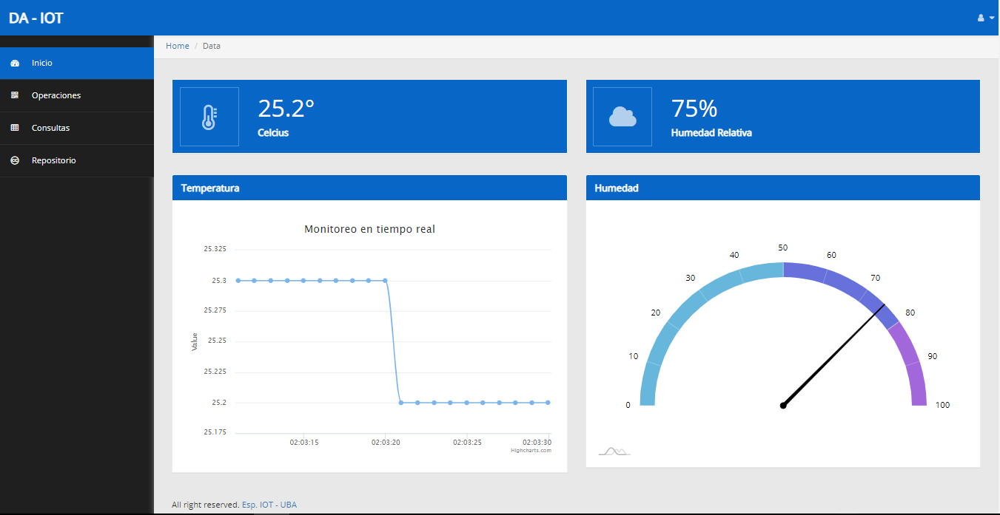
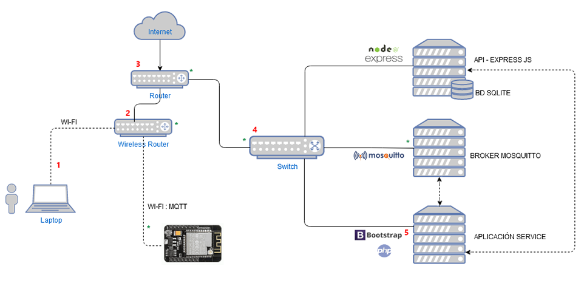
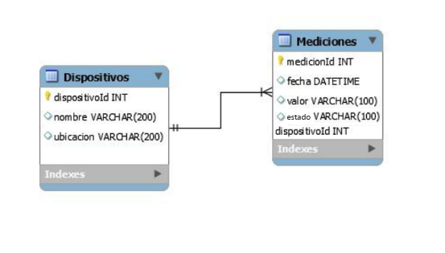
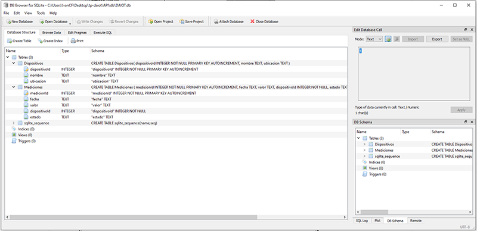
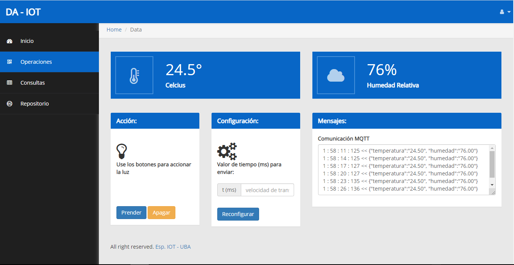

## Proyecto DA - IOT - UBA

Autores:
* Iván Cruz Flores
* Jose Severiche

Docente:

* Gustavo Ramoscelli

## Este proyecto esta formado por:
* Backend API: Express Js.
* Aplicación Service:
   - Frontend: Bootstrap 4 + Js + Paho Mqtt.
   - Backend: PHP.
* Base Datos: Sqlite.

## Dashboard Principal:
Vista principal de la aplicación:



## Prerrequisitos para el proyecto:
* Node js.
* Express js.
* Npm.
* Sqlite.
* Mosquitto Broker.
* Server web Apache (se recomienda usar Xampp).

## Arquitectura de componentes:



## Instalacion de dependencias:
Despues de clonar el repositorio se debe instalar las dependencias npm:

1.- Usando la terminal ubicarse dentro de la ruta del Backend API.
```
cd TP-DAIOT/API/

npm install
```
## Instrucciones de uso:
1.- Para levantar el backend API, con la terminal ubicarse dentro del directorio del backend API y ejecutar:
```diff

node index.js

- "Para algun cambio en index.js, detener el servicio y volver a ejecutarlo"
```

2.- Para levantar la aplicación service debera copiar la carpeta "Frontend" y colocarlo dentro de la ruta de la carpeta del web server (por ejemplo: C:\xampp\htdocs), luego levantar el server web Apache.
```diff
Abrir el navegador e ingresar a: http://localhost:8080/Frontend/

```

## Urls Importantes: 
* Backend API: http://localhost:3001/
* Frontend: http://localhost:8080/Frontend/


## Base de datos:
Para la persistencia de datos se usa:

* Base de datos SQLite

* Esquema relacional:



##  Herramienta de Base de datos:
El archivo de BD esta dentro del directorio llamado API y para visualizar sus valores se usó DB Browser SqLite.
* DB Browser for SQLite: https://sqlitebrowser.org/



## Operaciones API
* http://localhost:3001/inicializar/ : inicializar los valores por defecto cuando la BD esta vacia.
* http://localhost:3001/mediciones/:id : retorna un JSON con los datos del registro de mediciones por código ID.
* http://localhost:3001/dispositivos/ : retorna JSON con los dispositivos de la Base de Datos.
* http://localhost:3001/addMediciones/fecha/valor/dispositivoId : registra una nueva medición.

## Operaciones Frontend:
* Visualiza en modo gráfico en tiempo real el valor de la Temperatura.
* Visualiza en modo gráfico en tiempo real el valor de la humedad.
* Reconfigurar el tiempo de secuencia de envio de mensaje del ESP32 a la aplicación.
* Encender o Apagar un led desde la aplicación.
* Registrar las mediciones del sensor de temperatura.
* Registrar las mediciones del sensor de humedad.
* Resgistrar el estado actual de led Encendido/Apagado.
* Listar los registros de las mediciones del sensor de temperatura.
* Listar los registros de las mediciones del sensor de humedad.


## GUI de la App:

Inicio de la aplicación.


Interfaz de Operaciones .




## Licence:

This project is published under GPLV3+ licence.